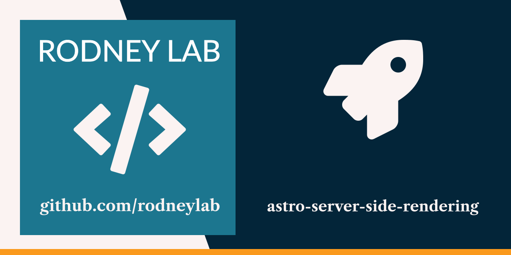

astro-server-side-renderin

  

<h1 align="center">
  Astro Server-Side Rendering
</h1>

# svelte-video blog

Starter code for the <a aria-label="Open Rodney Lab Plus Tutorial on Astro Server Sde Rendering" href="https://plus.rodneylab.com/tutorials/svelte-video-blog">Astro Server-Side Rendering tutorial</a> in which we build out a search site in Astro with Edge data customising for the visitor's location.

Feel free to jump into the [Rodney Lab matrix chat room](https://matrix.to/#/%23rodney:matrix.org).